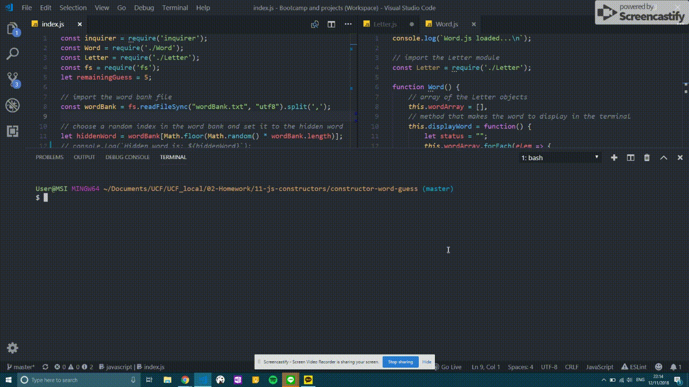

# constructor-word-guess
This is a word guess game build using Javascript constructors functions.
There are 4 files:
## 1. index.js
This file contains all of the logic for the program. It reads a file of names and randomly chooses one to be the word for the game. It makes a word object out of it and starts the game.

## 2. Letter.js
This file contains the constructor for each letter. Each letter is an object that contains:
a. The letter
b. A boolean indicating whether the letter has been guessed or not
c. A method to display or hide the letter
d. A method to check if the user's input matches the letter

## 3. Word.js
This file contains the constructor to make the word. The word is also an object that includes:
a. A word array containing letter objects
b. A method to display the current shown/ hidden letters
c. A method to check the user's input against the word array

## 4. wordBank.txt
This file is the list of words that get imported into the app

## Example:

